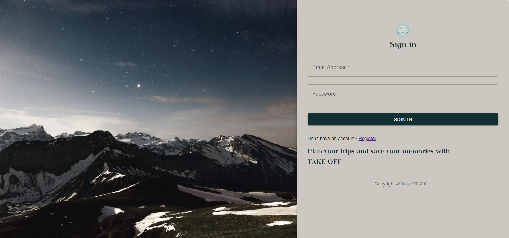

# TakeOff

<span align="center">

[](https://opensource.org/licenses/MIT)


</span>


## Table of Contents

- [Description](#description)

- [Server Dependencies](#server-dependencies)

- [Client Dependencies](#client-dependencies)

- [Installation Requirements](#installation-reqirements)

- [Configuration](#configuration)

- [Usage](#usage)

- [Contributing](#contributing)

- [Future Development](#future-development)

- [Contributors](#contributors)

- [License](#License)

## Description

TakeOff is a travel planning and blog application. Users can keep track of current and past trips. The itinerary creator allows the user to keep track of planned events or outings. Since traffic and weather conditions can affect your plans, with a travel itinarary on hand you can be more flexible.

Users can also create blogs of their favorite travel memories and list destinations for their future adventures.

<br/>




### Log in on Desktop
<br/>

## Server Dependencies
 - "@material-ui/core": "^4.11.3",
 - "@material-ui/icons": "^4.11.2",
 - "axios": "^0.21.1",
 - "bcrypt": "^5.0.1",
 - "bcryptjs": "^2.4.3",
 - "body-parser": "^1.19.0",
 - "cors": "^2.8.5",
 - "dotenv": "^8.2.0",
 - "express": "^4.17.1",
 - "if-env": "^1.0.4",
 - "is-empty": "^1.2.0",
 - "jsonwebtoken": "^8.5.1",
 - "mongoose": "^5.12.3",
 - "passport": "^0.4.1",
 - "passport-jwt": "^4.0.0",
 - "validator": "^13.5.2"

## Client Dependencies
 - "@date-io/date-fns": "^1.3.13",
 - "@material-ui/core": "^4.11.3",
 - "@material-ui/icons": "^4.11.2",
 - "@material-ui/pickers": "^3.3.10",
 - "@testing-library/jest-dom": "^5.11.10",
 - "@testing-library/react": "^11.2.6",
 - "@testing-library/user-event": "^12.8.3",
 - "axios": "^0.21.1",
 - "date-fns": "^2.20.0",
 - "jwt-decode": "^3.1.2",
 - "moment": "^2.29.1",
 - "react": "^17.0.2",
 - "react-dom": "^17.0.2",
 - "react-file-base64": "^1.0.3",
 - "react-redux": "^7.2.3",
 - "react-router-dom": "^5.2.0",
 - "react-scripts": "4.0.3",
 - "redux": "^4.0.5",
 - "redux-thunk": "^2.3.0",
 - "web-vitals": "^1.1.1"

## Installation Requirements

You will need [Node.js](https://nodejs.org/en/) and [MongoDB](https://www.mongodb.com/try/download/community) installed.

1. Clone this repo and install the required packages with the following command.
```
npm install
```

2. Make sure your command prompt in in the correct folder and type in the following to begin.
```
npm start
```

## Configuration

To configure this application for use, you should create a `.env` file with your database information. For convience, a sample enviroment variable file can be found in the root directory with the name of: `.env.sample`.

## Usage

You can click the [link](https://takeoff123.herokuapp.com/) to the deployed app or clone this repo.

## Contributing
If you would like to contribute to this project, please submit a pull request.

## Future Development
- Adding weather information about the destination
- Add a map for selecting your destination
- Make it possible for blogs to be viewed by others
- Creating a random location generator for those who need inspiration
- Render error on login page if user input is incorrect
## Contributors
[Bill Soss](https://github.com/sossw1),
[Emily Spoldi](https://github.com/espoldi),
[Nardin Lachowski](https://github.com/nard1n),
[Adrienne Osorio](https://github.com/amo02008),
[Adriana Valdiglesias](https://github.com/adrianavv1)

## License
This project is licensed under the MIT License. See the [License.md](./LICENSE) file for details.


